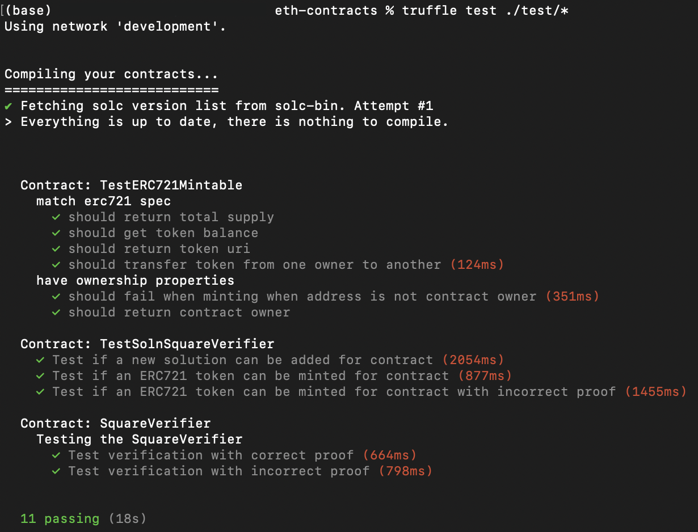
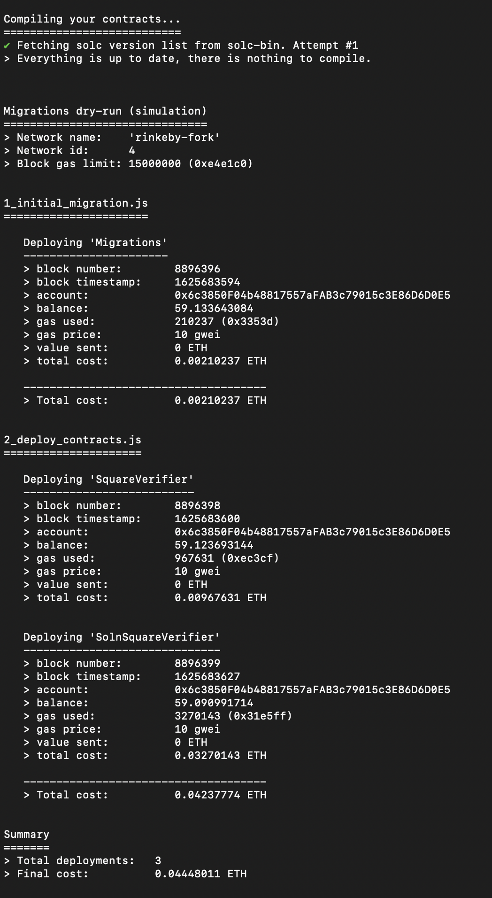
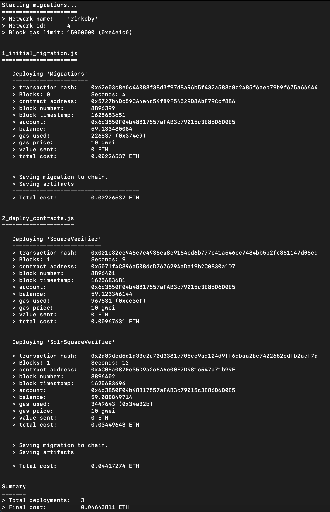
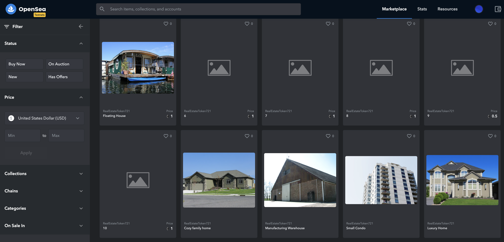

# Udacity Blockchain Capstone

The capstone will build upon the knowledge you have gained in the course in order to build a decentralized housing product. 

<br>

# How to install

This repository contains Smart Contract code in Solidity (using Truffle), tests (also using Truffle).

To install, download or clone the repo, then:

`npm install`  

`cd eth-contracts`  

Create a .secret and a .infurakey file in your __eth-contracts__ folder.  
See _Steps to migrate the contract to the Rinkeby Ethereum Testnet_ for info on what to add into the files (only needed if you want to migrate your smart contract to a network other than the local network).

`truffle compile`  

`ganache-cli -m "candy maple cake sugar pudding cream honey rich smooth crumble sweet treat" --accounts=20`

<br>

# Test your smart contracts

To run truffle tests, switch from the root folder to eth-contracts:

`cd eth-contracts`  

then run this command to execute just one specific test file

`truffle test ./test/TestERC721Mintable.js`  

or run

`truffle test ./test/*`

to run all tests at once.

<br>



<br>

# Steps to migrate the contract to the Rinkeby Ethereum Testnet

1. Create a .secret and a .infurakey file in your __eth-contracts__ folder.<br>
   The .secret file holds your Metamask mnemonic phrase.<br>
   In the .infurakey file you need to add your personal Infura PROJECT ID.

2. For compiling the contracts run `truffle compile` on your terminal within the eth-contracts folder.

3. For migrating the contract to your locale running Ethereum network (ganache) run `truffle migrate --reset`

4. For migrating the contract to the Rinkeby Ethereum Testnet run `truffle migrate --reset --network rinkeby`

<br>

## Output of the migration:



<br>

# Mint your tokens

Using MetaMask with MEW
- Login to your MetaMask wallet via their Chrome Extension.
- On the MEW front page, select 'Access My Wallet'.
- Select the 'Browser Extension' option to connect.
- Read and accept the 'Terms and Conditions', then select 'Access My Wallet'.
- Confirm connection in the MetaMask pop-up window.
- You're done!

Within the MEW account go to https://www.myetherwallet.com/interface/interact-with-contract and mint some tokens.

<br>

# Contract

Address: 0x4C05a0870e35D9a2c6A6e00E7D981c547a71b99E  

Contract info on etherscan.io: https://rinkeby.etherscan.io/address/0x4c05a0870e35d9a2c6a6e00e7d981c547a71b99e

Token info on etherscan.io: https://rinkeby.etherscan.io/token/0x4c05a0870e35d9a2c6a6e00e7d981c547a71b99e

ABI
```
[
    {
      "inputs": [
        {
          "internalType": "address",
          "name": "verifierAddress",
          "type": "address"
        },
        {
          "internalType": "string",
          "name": "name",
          "type": "string"
        },
        {
          "internalType": "string",
          "name": "symbol",
          "type": "string"
        }
      ],
      "payable": false,
      "stateMutability": "nonpayable",
      "type": "constructor"
    },
    {
      "anonymous": false,
      "inputs": [
        {
          "indexed": true,
          "internalType": "address",
          "name": "owner",
          "type": "address"
        },
        {
          "indexed": true,
          "internalType": "address",
          "name": "approved",
          "type": "address"
        },
        {
          "indexed": true,
          "internalType": "uint256",
          "name": "tokenId",
          "type": "uint256"
        }
      ],
      "name": "Approval",
      "type": "event"
    },
    {
      "anonymous": false,
      "inputs": [
        {
          "indexed": true,
          "internalType": "address",
          "name": "owner",
          "type": "address"
        },
        {
          "indexed": true,
          "internalType": "address",
          "name": "operator",
          "type": "address"
        },
        {
          "indexed": false,
          "internalType": "bool",
          "name": "approved",
          "type": "bool"
        }
      ],
      "name": "ApprovalForAll",
      "type": "event"
    },
    {
      "anonymous": false,
      "inputs": [
        {
          "indexed": false,
          "internalType": "address",
          "name": "caller",
          "type": "address"
        }
      ],
      "name": "Paused",
      "type": "event"
    },
    {
      "anonymous": false,
      "inputs": [
        {
          "indexed": true,
          "internalType": "address",
          "name": "from",
          "type": "address"
        },
        {
          "indexed": true,
          "internalType": "address",
          "name": "to",
          "type": "address"
        },
        {
          "indexed": true,
          "internalType": "uint256",
          "name": "tokenId",
          "type": "uint256"
        }
      ],
      "name": "Transfer",
      "type": "event"
    },
    {
      "anonymous": false,
      "inputs": [
        {
          "indexed": false,
          "internalType": "address",
          "name": "caller",
          "type": "address"
        }
      ],
      "name": "Unpaused",
      "type": "event"
    },
    {
      "anonymous": false,
      "inputs": [
        {
          "indexed": false,
          "internalType": "address",
          "name": "newOwner",
          "type": "address"
        }
      ],
      "name": "ownerShipTransfered",
      "type": "event"
    },
    {
      "anonymous": false,
      "inputs": [
        {
          "indexed": false,
          "internalType": "uint256",
          "name": "index",
          "type": "uint256"
        },
        {
          "indexed": false,
          "internalType": "address",
          "name": "solutionAddress",
          "type": "address"
        }
      ],
      "name": "solutionAdded",
      "type": "event"
    },
    {
      "constant": false,
      "inputs": [
        {
          "internalType": "bytes32",
          "name": "_myid",
          "type": "bytes32"
        },
        {
          "internalType": "string",
          "name": "_result",
          "type": "string"
        }
      ],
      "name": "__callback",
      "outputs": [],
      "payable": false,
      "stateMutability": "nonpayable",
      "type": "function"
    },
    {
      "constant": false,
      "inputs": [
        {
          "internalType": "bytes32",
          "name": "_myid",
          "type": "bytes32"
        },
        {
          "internalType": "string",
          "name": "_result",
          "type": "string"
        },
        {
          "internalType": "bytes",
          "name": "_proof",
          "type": "bytes"
        }
      ],
      "name": "__callback",
      "outputs": [],
      "payable": false,
      "stateMutability": "nonpayable",
      "type": "function"
    },
    {
      "constant": false,
      "inputs": [
        {
          "internalType": "address",
          "name": "to",
          "type": "address"
        },
        {
          "internalType": "uint256",
          "name": "tokenId",
          "type": "uint256"
        }
      ],
      "name": "approve",
      "outputs": [],
      "payable": false,
      "stateMutability": "nonpayable",
      "type": "function"
    },
    {
      "constant": true,
      "inputs": [
        {
          "internalType": "address",
          "name": "owner",
          "type": "address"
        }
      ],
      "name": "balanceOf",
      "outputs": [
        {
          "internalType": "uint256",
          "name": "",
          "type": "uint256"
        }
      ],
      "payable": false,
      "stateMutability": "view",
      "type": "function"
    },
    {
      "constant": true,
      "inputs": [],
      "name": "baseTokenURI",
      "outputs": [
        {
          "internalType": "string",
          "name": "",
          "type": "string"
        }
      ],
      "payable": false,
      "stateMutability": "view",
      "type": "function"
    },
    {
      "constant": true,
      "inputs": [
        {
          "internalType": "uint256",
          "name": "tokenId",
          "type": "uint256"
        }
      ],
      "name": "getApproved",
      "outputs": [
        {
          "internalType": "address",
          "name": "",
          "type": "address"
        }
      ],
      "payable": false,
      "stateMutability": "view",
      "type": "function"
    },
    {
      "constant": true,
      "inputs": [
        {
          "internalType": "address",
          "name": "owner",
          "type": "address"
        },
        {
          "internalType": "address",
          "name": "operator",
          "type": "address"
        }
      ],
      "name": "isApprovedForAll",
      "outputs": [
        {
          "internalType": "bool",
          "name": "",
          "type": "bool"
        }
      ],
      "payable": false,
      "stateMutability": "view",
      "type": "function"
    },
    {
      "constant": false,
      "inputs": [
        {
          "internalType": "address",
          "name": "to",
          "type": "address"
        },
        {
          "internalType": "uint256",
          "name": "tokenId",
          "type": "uint256"
        },
        {
          "internalType": "string",
          "name": "tokenURI",
          "type": "string"
        }
      ],
      "name": "mint",
      "outputs": [
        {
          "internalType": "bool",
          "name": "",
          "type": "bool"
        }
      ],
      "payable": false,
      "stateMutability": "nonpayable",
      "type": "function"
    },
    {
      "constant": true,
      "inputs": [],
      "name": "name",
      "outputs": [
        {
          "internalType": "string",
          "name": "",
          "type": "string"
        }
      ],
      "payable": false,
      "stateMutability": "view",
      "type": "function"
    },
    {
      "constant": true,
      "inputs": [],
      "name": "owner",
      "outputs": [
        {
          "internalType": "address",
          "name": "",
          "type": "address"
        }
      ],
      "payable": false,
      "stateMutability": "view",
      "type": "function"
    },
    {
      "constant": true,
      "inputs": [
        {
          "internalType": "uint256",
          "name": "tokenId",
          "type": "uint256"
        }
      ],
      "name": "ownerOf",
      "outputs": [
        {
          "internalType": "address",
          "name": "",
          "type": "address"
        }
      ],
      "payable": false,
      "stateMutability": "view",
      "type": "function"
    },
    {
      "constant": false,
      "inputs": [],
      "name": "pause",
      "outputs": [],
      "payable": false,
      "stateMutability": "nonpayable",
      "type": "function"
    },
    {
      "constant": false,
      "inputs": [
        {
          "internalType": "address",
          "name": "from",
          "type": "address"
        },
        {
          "internalType": "address",
          "name": "to",
          "type": "address"
        },
        {
          "internalType": "uint256",
          "name": "tokenId",
          "type": "uint256"
        }
      ],
      "name": "safeTransferFrom",
      "outputs": [],
      "payable": false,
      "stateMutability": "nonpayable",
      "type": "function"
    },
    {
      "constant": false,
      "inputs": [
        {
          "internalType": "address",
          "name": "from",
          "type": "address"
        },
        {
          "internalType": "address",
          "name": "to",
          "type": "address"
        },
        {
          "internalType": "uint256",
          "name": "tokenId",
          "type": "uint256"
        },
        {
          "internalType": "bytes",
          "name": "_data",
          "type": "bytes"
        }
      ],
      "name": "safeTransferFrom",
      "outputs": [],
      "payable": false,
      "stateMutability": "nonpayable",
      "type": "function"
    },
    {
      "constant": false,
      "inputs": [
        {
          "internalType": "address",
          "name": "to",
          "type": "address"
        },
        {
          "internalType": "bool",
          "name": "approved",
          "type": "bool"
        }
      ],
      "name": "setApprovalForAll",
      "outputs": [],
      "payable": false,
      "stateMutability": "nonpayable",
      "type": "function"
    },
    {
      "constant": true,
      "inputs": [
        {
          "internalType": "bytes4",
          "name": "interfaceId",
          "type": "bytes4"
        }
      ],
      "name": "supportsInterface",
      "outputs": [
        {
          "internalType": "bool",
          "name": "",
          "type": "bool"
        }
      ],
      "payable": false,
      "stateMutability": "view",
      "type": "function"
    },
    {
      "constant": true,
      "inputs": [],
      "name": "symbol",
      "outputs": [
        {
          "internalType": "string",
          "name": "",
          "type": "string"
        }
      ],
      "payable": false,
      "stateMutability": "view",
      "type": "function"
    },
    {
      "constant": true,
      "inputs": [
        {
          "internalType": "uint256",
          "name": "index",
          "type": "uint256"
        }
      ],
      "name": "tokenByIndex",
      "outputs": [
        {
          "internalType": "uint256",
          "name": "",
          "type": "uint256"
        }
      ],
      "payable": false,
      "stateMutability": "view",
      "type": "function"
    },
    {
      "constant": true,
      "inputs": [
        {
          "internalType": "address",
          "name": "owner",
          "type": "address"
        },
        {
          "internalType": "uint256",
          "name": "index",
          "type": "uint256"
        }
      ],
      "name": "tokenOfOwnerByIndex",
      "outputs": [
        {
          "internalType": "uint256",
          "name": "",
          "type": "uint256"
        }
      ],
      "payable": false,
      "stateMutability": "view",
      "type": "function"
    },
    {
      "constant": true,
      "inputs": [
        {
          "internalType": "uint256",
          "name": "tokenId",
          "type": "uint256"
        }
      ],
      "name": "tokenURI",
      "outputs": [
        {
          "internalType": "string",
          "name": "",
          "type": "string"
        }
      ],
      "payable": false,
      "stateMutability": "view",
      "type": "function"
    },
    {
      "constant": true,
      "inputs": [],
      "name": "totalSupply",
      "outputs": [
        {
          "internalType": "uint256",
          "name": "",
          "type": "uint256"
        }
      ],
      "payable": false,
      "stateMutability": "view",
      "type": "function"
    },
    {
      "constant": false,
      "inputs": [
        {
          "internalType": "address",
          "name": "from",
          "type": "address"
        },
        {
          "internalType": "address",
          "name": "to",
          "type": "address"
        },
        {
          "internalType": "uint256",
          "name": "tokenId",
          "type": "uint256"
        }
      ],
      "name": "transferFrom",
      "outputs": [],
      "payable": false,
      "stateMutability": "nonpayable",
      "type": "function"
    },
    {
      "constant": false,
      "inputs": [
        {
          "internalType": "address",
          "name": "newOwner",
          "type": "address"
        }
      ],
      "name": "transferOwnership",
      "outputs": [],
      "payable": false,
      "stateMutability": "nonpayable",
      "type": "function"
    },
    {
      "constant": false,
      "inputs": [],
      "name": "unpause",
      "outputs": [],
      "payable": false,
      "stateMutability": "nonpayable",
      "type": "function"
    },
    {
      "constant": false,
      "inputs": [
        {
          "internalType": "address",
          "name": "to",
          "type": "address"
        },
        {
          "internalType": "uint256",
          "name": "tokenId",
          "type": "uint256"
        },
        {
          "internalType": "uint256[2]",
          "name": "a",
          "type": "uint256[2]"
        },
        {
          "internalType": "uint256[2][2]",
          "name": "b",
          "type": "uint256[2][2]"
        },
        {
          "internalType": "uint256[2]",
          "name": "c",
          "type": "uint256[2]"
        },
        {
          "internalType": "uint256[2]",
          "name": "input",
          "type": "uint256[2]"
        }
      ],
      "name": "mintNFT",
      "outputs": [
        {
          "internalType": "uint256",
          "name": "",
          "type": "uint256"
        }
      ],
      "payable": false,
      "stateMutability": "nonpayable",
      "type": "function"
    }
]
```

<br>

# OpenSea

Marketplace: https://testnets.opensea.io/assets/realestatetoken721



Assets:

Belongs to [0x6c3850f04b48817557afab3c79015c3e86d6d0e5](https://testnets.opensea.io/0x6c3850f04b48817557afab3c79015c3e86d6d0e5) (Creator):
https://testnets.opensea.io/assets/0x4c05a0870e35d9a2c6a6e00e7d981c547a71b99e/1
https://testnets.opensea.io/assets/0x4c05a0870e35d9a2c6a6e00e7d981c547a71b99e/2
https://testnets.opensea.io/assets/0x4c05a0870e35d9a2c6a6e00e7d981c547a71b99e/3
https://testnets.opensea.io/assets/0x4c05a0870e35d9a2c6a6e00e7d981c547a71b99e/4
https://testnets.opensea.io/assets/0x4c05a0870e35d9a2c6a6e00e7d981c547a71b99e/10

Bought from [0xE9DEa8A0c6724Dbc1B837Bd56FCDf36f0d954b51](https://testnets.opensea.io/0xe9dea8a0c6724dbc1b837bd56fcdf36f0d954b51):
https://testnets.opensea.io/assets/0x4c05a0870e35d9a2c6a6e00e7d981c547a71b99e/5
https://testnets.opensea.io/assets/0x4c05a0870e35d9a2c6a6e00e7d981c547a71b99e/6
https://testnets.opensea.io/assets/0x4c05a0870e35d9a2c6a6e00e7d981c547a71b99e/7
https://testnets.opensea.io/assets/0x4c05a0870e35d9a2c6a6e00e7d981c547a71b99e/8
https://testnets.opensea.io/assets/0x4c05a0870e35d9a2c6a6e00e7d981c547a71b99e/9


<br>

# Generate Proof with Zokrates

1. Using [Docker](https://docs.docker.com/get-docker/) to install and instantiate a Zokrates zkSnarks development environment
2. Navigate to the zokrates project folder: `cd zokrates/code`
3. Run ZoKrates docker container: `docker run -v $(pwd):/home/zokrates/code -ti zokrates/zokrates /bin/bash` 
4. Now you are inside the container. Change path to the code/square folder: `cd code/square/`
5. Compile the program written in ZoKrates DSL: `zokrates compile -i square.code`
6. Generate the Trusted Setup: `zokrates setup`
7. Compute Witness: `zokrates compute-witness -a 3 9`
8. Generate Proof: `zokrates generate-proof`
9. Export Verifier: `zokrates export-verifier`  
   The last command generates our 'verifier' smart contract which I moved to the **eth-contracts/contracts** folder and renamed to **SquareVerifier.sol** afterwards.  
   In the contract file I changed the solidity info to `pragma solidity ^0.5.0;`

<br>

# Versions

`truffle version`

> Truffle v5.3.2 (core: 5.3.2)  
> Solidity - ^0.5.0 (solc-js)  
> Node v15.14.0  
> Web3.js v1.3.5

<br>

# Project Resources

* [Remix - Solidity IDE](https://remix.ethereum.org/)
* [Visual Studio Code](https://code.visualstudio.com/)
* [Truffle Framework](https://truffleframework.com/)
* [Ganache - One Click Blockchain](https://truffleframework.com/ganache)
* [Open Zeppelin ](https://openzeppelin.org/)
* [Interactive zero knowledge 3-colorability demonstration](http://web.mit.edu/~ezyang/Public/graph/svg.html)
* [Docker](https://docs.docker.com/install/)
* [ZoKrates](https://github.com/Zokrates/ZoKrates)
